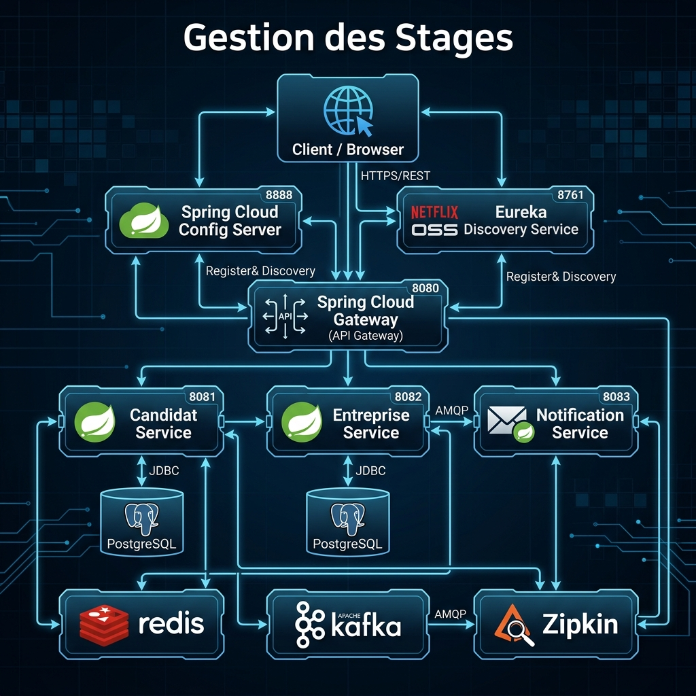

#  Gestion des Stages (Microservices Architecture)

Ce projet est une application de gestion de stages basée sur une architecture de microservices avec **Spring Boot**, **Spring Cloud** et **PostgreSQL**.

##  Architecture Technique

Le projet est conçu pour être scalable, résilient et facile à surveiller grâce aux technologies suivantes :

- **Spring Cloud Config Server** (Port : 9999) : Centralisation de la configuration.
- **Eureka Discovery Service** (Port : 8761) : Service de découverte pour l'annuaire des microservices.
- **API Gateway** (Port : 8888) : Point d'entrée unique pour toutes les requêtes clients.
- **Zipkin** (Port : 9411) : Traçabilité distribuée pour le débogage.
- **Redis** (Port : 6379) : Système de cache distribué.
- **Apache Kafka** (Port : 9092) : Streaming d'événements asynchrones entre les services.

## Microservices

| Service | Port | Base de Données | Description |
|---|---|---|---|
| **Candidat Service** | 8080 | PostgreSQL (`candidat_db`) | Gestion des profils candidats. |
| **Entreprise Service** | 8081 | PostgreSQL (`entreprise_db`) | Gestion des offres et entreprises. |
| **Notification Service** | 8082 | - | Envoi automatique d'emails via Kafka. |

##  Lancement Rapide

### Prérequis
- Docker & Docker Compose
- Java 17+
- Maven

